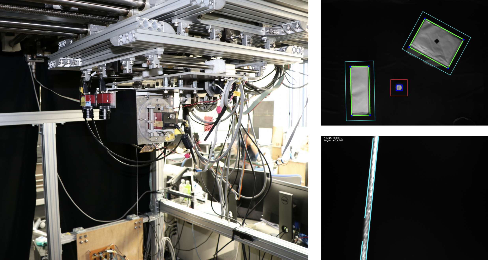

# Osumi Tereope API (クレーンテレオペ班)

Project carried out at the OSUMI Robot Mechatronics Laboratory at Chuo University (Japan), contributing to the development of a laboratory crane system.

## Overview

The crane has 5 control axes spread across 3 motion systems plus 4 cameras: two track the rope along the X and Y axes and two observe the crane's workspace. The goal of this project was an image-processing pipeline that lets the crane avoid obstacles using the cameras mounted on its trolley.

## Features

- Hardware control library: A dedicated software library drives the crane through two interface boards: a CNT-3208M-PE counter board that reads motor encoder counts and a DA16-16(LPCI)L board that applies analog voltages to the motors.

- Obstacle detection: Obstacles in the scene are found with thresholding and contour detection and bounding rectangles give their exact coordinates.

- Collision avoidance: An algorithm predicts and prevents collisions between the crane's load and obstacles in the scene.

- Stereo vision: Point correspondences between the two scene cameras are used to estimate obstacle heights so the crane can raise its load and pass over them.

- Anti-sway controller: A controller measures the rope angle on the X and Y axes and applies counter-motion through the crane's fine-motion system to reduce oscillations while the crane is operating.
